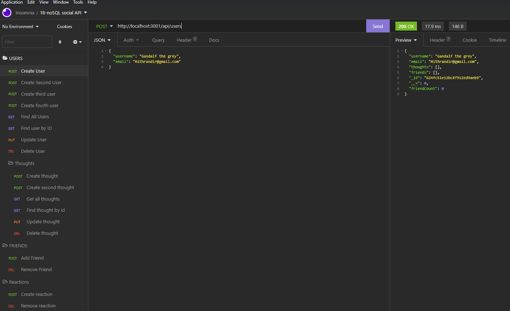
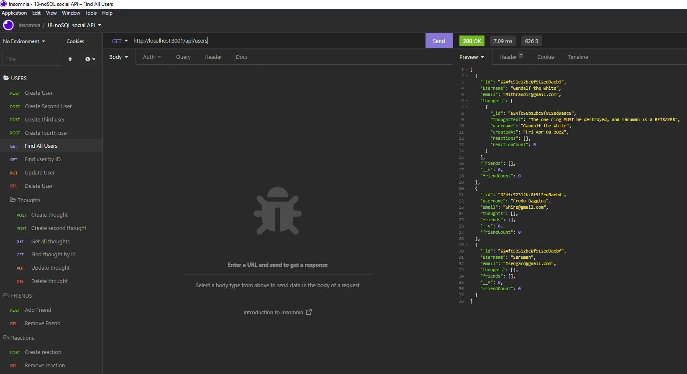
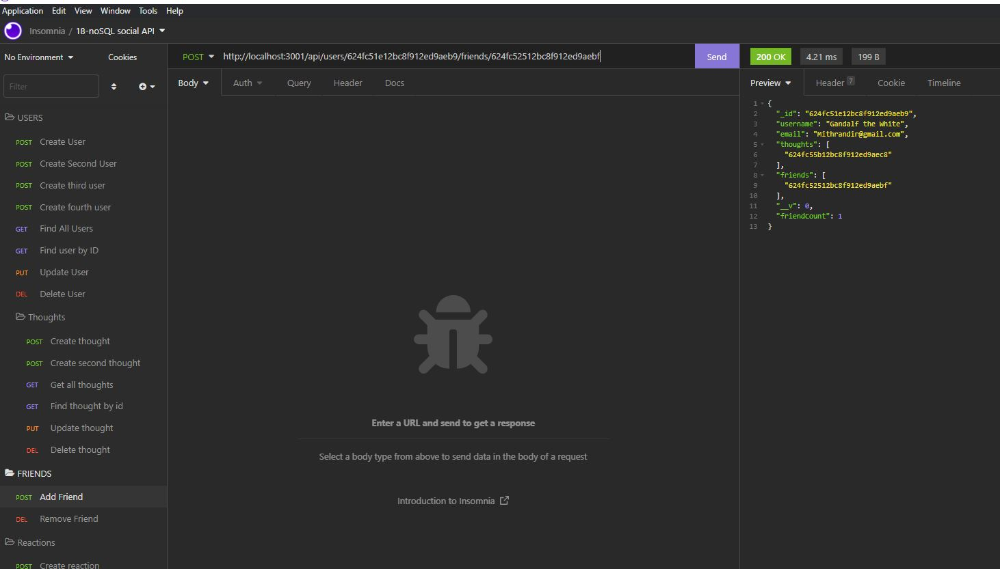
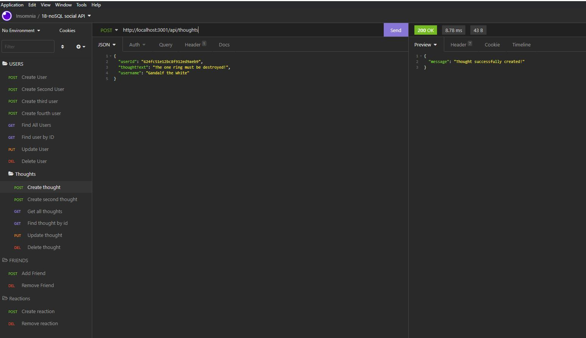
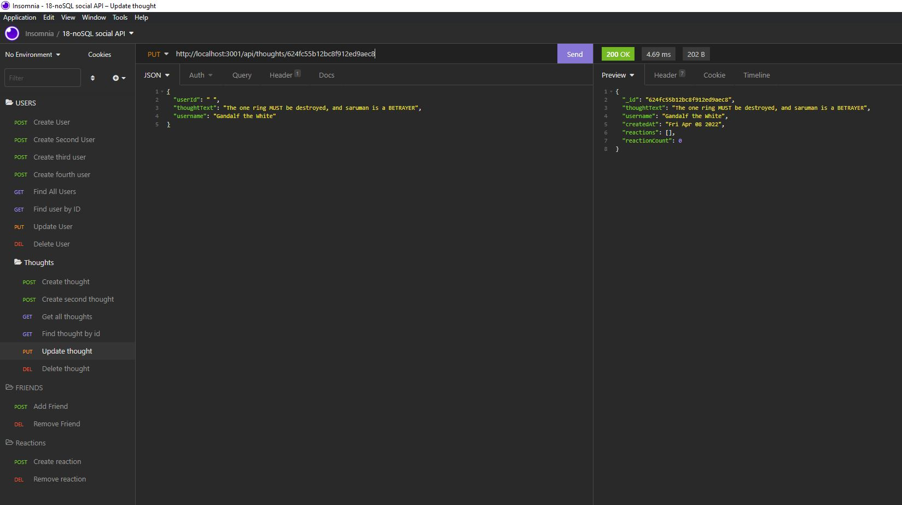

# MongoDB-Social-Networking-API
  [](https://opensource.org/licenses/MIT)
# Description
This Application is a MongoDB based API which can be utilised for a Social Network. 
Functionality includes: 
- The ability for users to share their thoughts with other users 
- React to the thoughts of others 
- Create a friend's list including other users

The application was written using JavaScript and includes the following technologies: 
- [Node.js](https://nodejs.org/en/) 
- [Express.js](https://expressjs.com) 
- [Mongoose.js](https://mongoosejs.com/)
- [Dotenv](https://www.npmjs.com/package/dotenv)
# Table of Contents
* [Installation](#installation)
* [Usage](#usage)
* [License](#license)
* [Contributing](#contributing)
* [Tests](#tests)
* [Questions](#tests)
# Installation
The following dependencies are necessary to run this application: 

- To run this application effectively, please have Node.js installed on your computer.
- Clone the Repository onto your local machine using ```git clone git@github.com:Pattiqus/mongoDB-Social-Networking-API.git```
- Other required modules are bundled in the package.json file provided, by running “npm i” from the CLI or Terminal inside the applications directory, these modules will be installed.


# Usage
This application does not have a dedicated front end to utilize, so interaction will occur through an API client such as ```Insomnia``` or  ```Postman```.
# Demonstration Video
- [Click-for-Demo-Video](https://drive.google.com/file/d/1wFkJQ1aWtUT87dDDuE_jn3VsjojyrwME/view?usp=sharing)
# Screenshots
<p>Create user</p>

- 

<p>Get all users</p>

- 

<p>Add friend</p>

- 
<p>Create thought</p>

- 

<p>Update thought</p>

- 

# License
This project is licensed under:
- [MIT](https://opensource.org/licenses/MIT)

# Contributing
Contributors: 
```
Pat Brown (Pattiqus)
```
# Tests
This application was not developed using a Test driven environment.
# Questions
If you have any qestions regrading the repository or the project please contact: 
<ul>
  <li>GitHub:  <a href=https://github.com/pattiqus>pattiqus</a></li> 
  <li>Email: <a href=mailto:Patticus.tv@gmail.com>Patticus.tv@gmail.com</a></li>
  <li>LinkedIn: <a href=https://www.linkedin.com/in/patrick-brown-52553410a>Pat Brown</a></li>
</ul>

# Links
- [GitHub Repository](https://github.com/Pattiqus/mongoDB-Social-Networking-API)